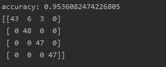
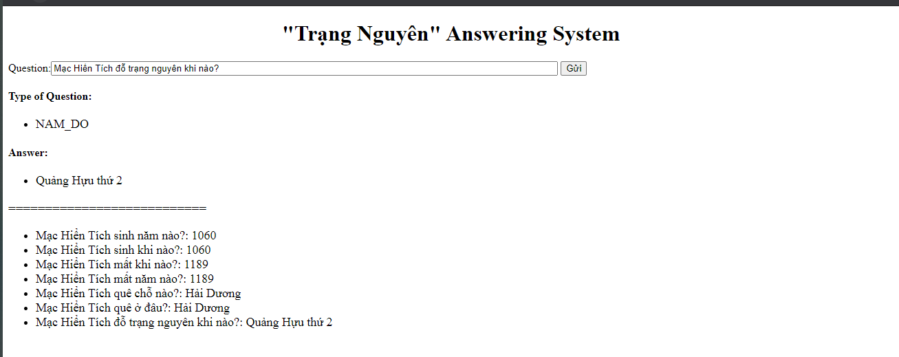

# Question Answering system for "Trạng Nguyên" in VietNam
  * System pineline: Question classification, Information Retrieval and Answer extraction
* 
## Question classification:
  * Navie Bayes from scikit-learn for train the model with ~600 questions labeled.
  * Accuracy: ~95.3% (test set)
* 
## Information Retrieval:
  * Lucene libary to caculate distance score between the document from data and the question.  
## Answer Extraction:
  * Regular Expression with basic keywords to extract the answer from the document.    .
## Basic Web demo:
* 
