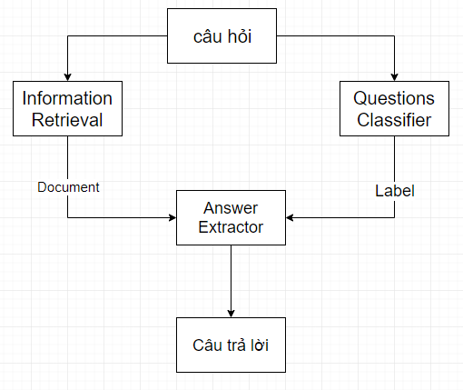

# Question Answering system for "Trạng Nguyên" in VietNam
System pineline: Question classification, Information Retrieval and Answer extraction

## Question classification:
  Using Navie Bayes from scikit-learn with ~300 questions to train.
  Accuracy: ~83.3%
## Information Retrieval:
  From question, using IR to take document from data folder for Answer Extraction part.  
## Answer Extraction:
  Using Regular Expression with basic keywords.
